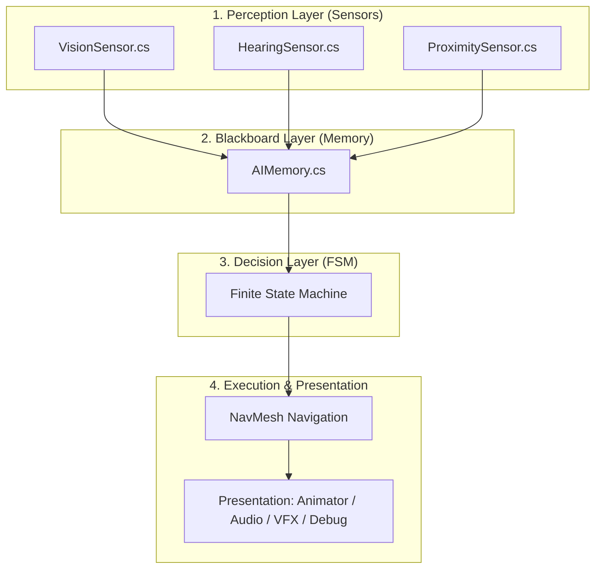
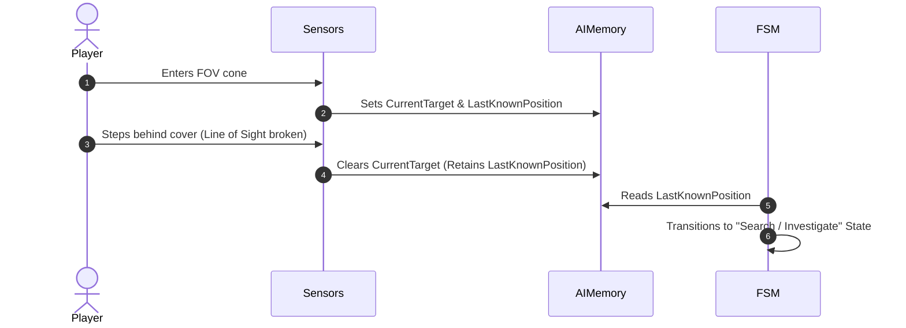
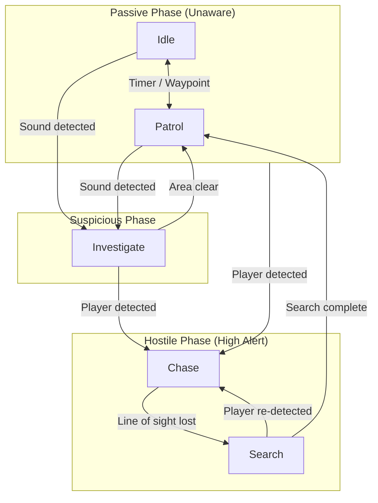

# Stealth AI Architecture & Framework

A modular, decoupled framework for 3D stealth Artificial Intelligence built on a pipeline architecture consisting of **Sensors**, **Memory (Blackboard)**, **Finite State Machine (FSM)**, and a **Presentation Layer**.

## 1. High-Level Architecture

The system operates via a unidirectional processing pipeline: environmental stimuli are gathered by autonomous sensors, filtered and stored by a persistent memory module, processed by the FSM for decision-making, and executed via navigation and presentation layers.

## 2. Perception Layer (`Perception/`)

The perception system is split across three autonomous sensors. Each sensor maintains a single responsibility: evaluating specific environmental stimuli and updating relevant memory entries.

### 2.1. `VisionSensor.cs`

Evaluates whether the target resides within the entity's vision frustum through topological checks and physical occlusion testing.

* **Detection Criteria:**
  1. Target is within the field-of-view angle ($FOV$).
  2. Distance to target is less than or equal to the maximum view radius ($R_{max}$).
  3. A direct raycast from the AI's eye socket confirms **unobstructed line of sight** (filtered via configured `RaycastMask`).
* **Core Responsibility:** Answers the query: *Can I see the player?*

### 2.2. `HearingSensor.cs`

Subscribes the AI entity to global gameplay audio events.

* **Detected Stimuli:**
  * Footsteps (filtered by movement speed or surface material).
  * Thrown object impacts.
  * Environmental interactions.
* **Stimulus Mapping:** Determines if sound intensity exceeds the attenuation threshold at the AI's location and provides the world coordinates of the audio origin.
* **Core Responsibility:** Answers the query: *Did I hear a relevant event, and where did it occur?*

### 2.3. `ProximitySensor.cs`

An immediate physical security perimeter surrounding the entity that triggers regardless of the AI's facing direction.

* **Mechanism:** Detects close-range physical presence (proximity collision or direct contact).
* **Core Responsibility:** Answers the query: *Is an enemy entity within immediate contact range?*

## 3. Memory System (`AIMemory.cs`)

The memory module acts as a localized **Blackboard**. It retains persistent data after physical stimuli cease, enabling search and investigation behaviors.

| Variable | Data Type | Description |
| :--- | :--- | :--- |
| `CurrentTarget` | `Transform / Entity` | Direct reference to the actively tracked target. |
| `LastKnownPosition` | `Vector3` | Last recorded spatial coordinates where the target was **seen**. |
| `LastHeardPosition` | `Vector3` | Last recorded spatial coordinates where a sound was **heard**. |
| `LastSeenTime` | `float` | Timestamp of the last verified visual contact. |
| `LastHeardTime` | `float` | Timestamp of the last audio stimulus detection. |

## 4. Finite State Machine (FSM)

The FSM dictates strategic AI decisions based exclusively on the state data stored inside `AIMemory`.

### 4.1. State Flow Diagram

### 4.2. State Transition Matrix

To eliminate ambiguity in state handling, the following table deterministically defines all valid transitions:

| Current State | Trigger / Event | Target State | Associated Action |
| :--- | :--- | :--- | :--- |
| **`Idle`** | Wait timer expired | `Patrol` | Select next waypoint from circuit route. |
| | Sound event detected | `Investigate` | Set navigation destination to `LastHeardPosition`. |
| | Visual detection confirmed | `Chase` | Assign `CurrentTarget` and set sprint speed. |
| **`Patrol`** | Waypoint reached | `Idle` | Trigger idle wait timer. |
| | Sound event detected | `Investigate` | Abandon patrol path; move to `LastHeardPosition`. |
| | Visual detection confirmed | `Chase` | Interrupt patrol and initiate target pursuit. |
| **`Investigate`** | Visual detection confirmed | `Chase` | Immediately escalate to active pursuit. |
| | Destination reached & area clear | `Patrol` | Resume standard patrol loop. |
| **`Chase`** | Line of Sight ($LoS$) lost | `Search` | Navigate directly to `LastKnownPosition`. |
| **`Search`** | Visual detection confirmed | `Chase` | Resume direct visual tracking. |
| | Search timer expired | `Patrol` | Flush non-essential `AIMemory` entries; resume patrol. |

## 5. Navigation System

Navigation logic is decoupled from state decision-making. The FSM assigns movement intent, while the navigation controller executes pathfinding using `NavMeshAgent`.

## 6. Presentation & Debugging Tools

To ensure rapid debugging during iteration, the system includes visual debugging tools driven by `Gizmos`:

* **Visual Perceptual Gizmos:**
  * Field of view cone indicating limits and state changes (green = clear, red = target acquired).
  * Hearing range sphere and point marker for sound events.
  * Real-time line-of-sight raycast vector rendering.
* **State & Memory Debuggers:**
  * World-space floating text displaying current FSM state directly above the entity mesh.
  * In-scene spatial markers for `LastKnownPosition` and `LastHeardPosition`.
  * Visual rendering of the active `NavMeshAgent` path buffer.
