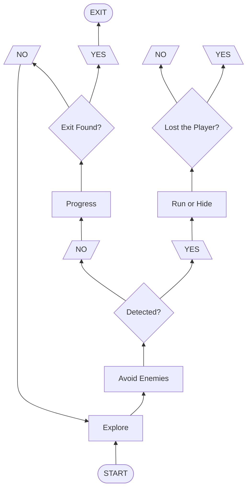

# STAY SEEN

**STAY SEEN** is a small stealth prototype developed in Unity 6.

The player takes control of a warrior who has been captured and imprisoned in a dungeon. Upon awakening, he discovers that he is unarmed and must find a way to escape while avoiding detection by the creatures patrolling the area.

The game is centered around **enemy AI**, with a particular focus on their **perception and behavior**. For more information about the AI systems and their architecture, see [`AIArchitecture.md`](AIArchitecture.md).

### Game Loop

