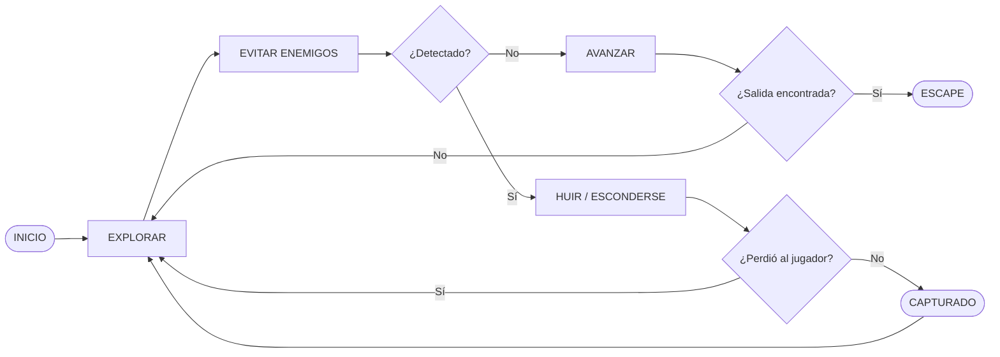

**STAY SEEN** es un pequeño prototipo de sigilo desarrollado en Unity 6.

El jugador controla a un guerrero que ha sido capturado y encerrado en una dungeon. Al despertar, descubre que está desarmado y debe encontrar una forma de escapar mientras evita ser descubierto por las criaturas que patrullan la zona.

El juego está centrado en la **IA de los enemigos**, especialmente en su percepción y comportamiento.

### GameLoop

